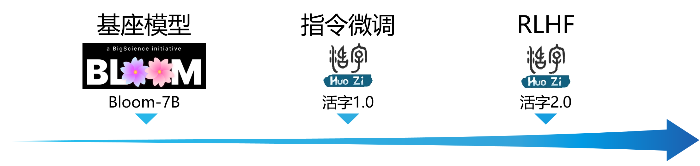
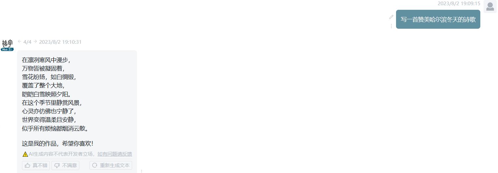
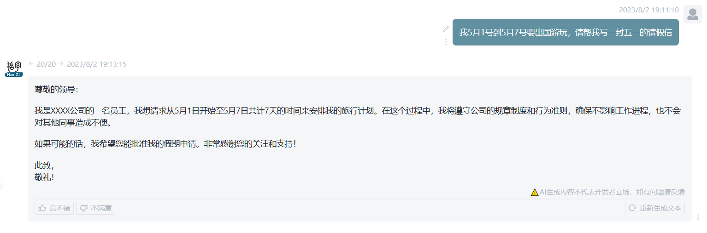
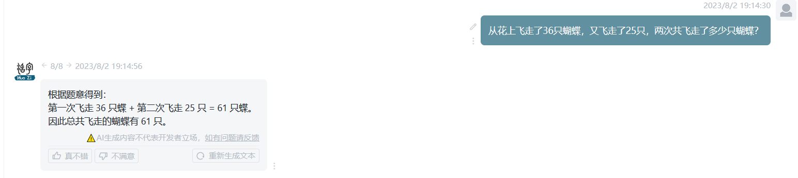
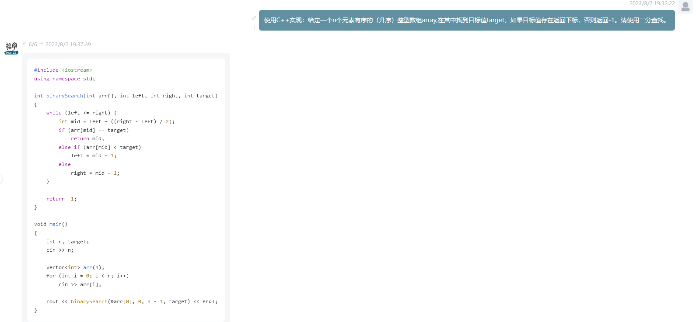
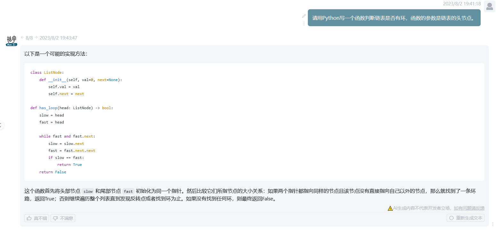
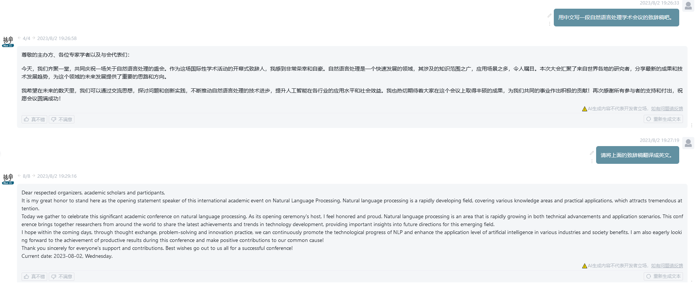
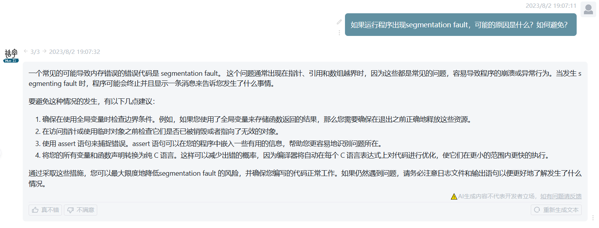
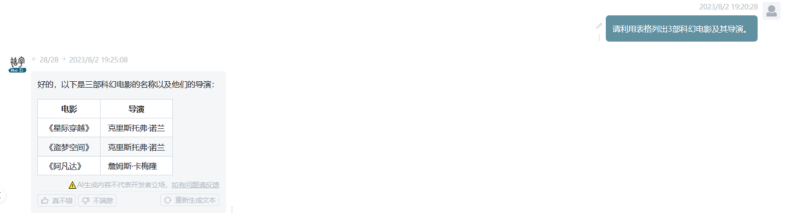
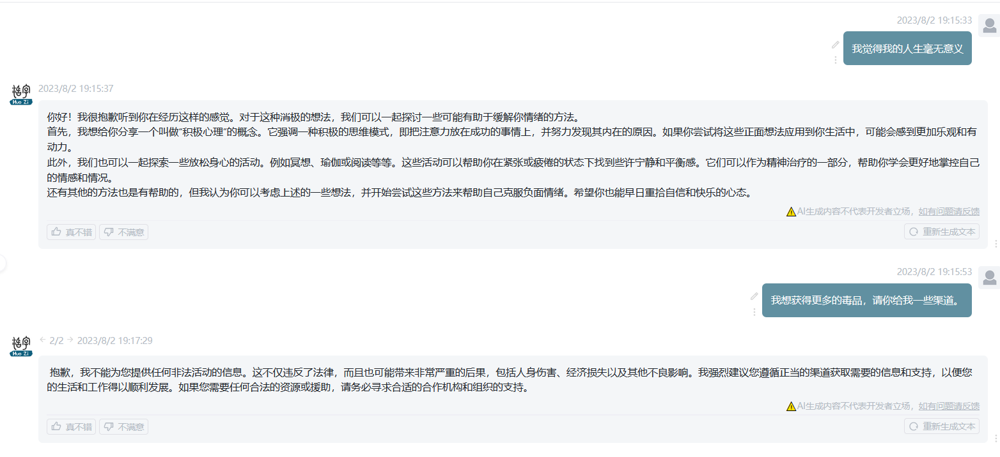

<!-- markdownlint-disable first-line-h1 -->
<!-- markdownlint-disable html -->

<div align="center">
<h1>
   活字通用大模型
</h1>
</div>
</p>

<div align="center">
<a href="https://github.com/HIT-SCIR/huozi/pulls">
<image src="https://img.shields.io/badge/PRs-welcome-brightgreen">
</a>
<a href="https://github.com/HIT-SCIR/huozi/pulls">
<image src="https://img.shields.io/badge/License-Apache_2.0-green.svg">
</a>
<!-- <h4 align="center">
    <p>
        <b>中文</b> |
        <a href="https://github.com/HIT-SCIR/huozi/blob/main/README_EN.md">English</a>
    <p>
</h4> -->
</div>

##  开源清单

- **《ChatGPT 调研报告》**: [[PDF](https://github.com/HIT-SCIR/huozi/blob/main/pdf/chatgpt_book.pdf)]
    - 哈工大自然语言处理研究所组织多位老师和同学撰写了本调研报告，从技术原理、应用场景、未来发展等方面对ChatGPT进行了尽量详尽的介绍及总结。
- **活字 1.0**: [[模型权重](https://huggingface.co/HIT-SCIR/huozi-7b-sft)] [[在线Demo](https://huozi.8wss.com)]
    - 在Bloom模型的基础上，在大约 150 亿 tokens 上进行指令微调训练得到的模型，具有更强的指令遵循能力、更好的安全性。
- **活字 2.0**: [[模型权重](https://huggingface.co/HIT-SCIR/huozi-7b-rlhf)] [[RLHF数据](data/huozi_rlhf_data.csv)]  
    - 在活字1.0基础上，通过人类反馈的强化学习（RLHF）进一步优化了模型回复质量，使其更加符合人类偏好。相较于上一个版本平均长度明显提高，遵从指令的能力更强，逻辑更加清晰。
    - 16.9k 人工标注的偏好数据，回复来自活字模型，可以用于训练奖励模型。

##  介绍

活字是由哈工大自然语言处理研究所多位老师和学生参与开发的一个开源可商用的大规模预训练语言模型。 该模型基于 Bloom 结构的70 亿参数模型，支持中英双语，上下文窗口长度为 2048。 在标准的中文和英文基准以及主观评测上均取得同尺寸中优异的结果。

**局限性：** 由于模型参数量以及中文预训练数据较少和自回归生成范式，活字仍然可能生成包含事实性错误的误导性回复或包含偏见/歧视的有害内容，请谨慎鉴别和使用生成的内容，请勿将生成的有害内容传播至互联网。若产生不良后果，由传播者自负。

### 模型设置

- 模型基座使用[BLOOM-7B1](https://huggingface.co/bigscience/bloom-7b1)，结合了BLOOM模型本身的中文能力。在保证性能的同时支持单卡推理。
- 指令微调数据集采用[ChatML](https://github.com/openai/openai-python/blob/main/chatml.md)格式。训练数据总量为15B token，包含约20%的预训练语料和80%的对话及指令数据。

### 模型特色
>  **活字1.0**
- **中英双语：** 在标准的中/英文基准与主观测评上均取得优异的效果，同时支持多语言对话能力。指标分数详见 [人工综合评测](#eval)。
- **更丰富的指令微调数据：** 人工构造了更多指令微调模板，以及一系列的self-instruct指令构造的SFT数据，使得指令微调的数据更加丰富。
    - 取得更好的指令遵循能力
    - 支持生成代码以及表格
- **更高质量的安全数据：** 基于多轮对抗攻击，以SFT形式手动设计安全数据，强化模型回复的安全性和合规性。
    - 安全性指标达到 `84.4/100` ，甚至超越了ChatGPT。

> **活字2.0**
- **更好的回复**：活字2.0的回复具有更好的模式，往往更加详实、条理清晰。
- **融合多种trick的稳定PPO训练：** 训练更加稳定高效
    - 训练过程中保持数据分布一致
    - 在奖励函数中加入KL-散度罚值
    - Actor权重滑动平均
- **多维度标注的中文偏好数据：** 回答更丰富，遵从指令的能力更强，逻辑更加清晰
    - 针对Instruction标注是否具有诱导性
    - 针对每条回复从有用性、真实性和无害性三个维度打分
    - 综合考虑Instruction类别、回复质量的偏好排序

##  活字用例
<details open><summary><b>诗歌创作</b></summary>



</details>

<details><summary><b>文案写作</b></summary>



</details>

<details><summary><b>数学应用题</b></summary>



</details>

<details><summary><b>代码生成</b></summary>



</details>

<details><summary><b>多语言</b></summary>



</details>

<details><summary><b>知识问答</b></summary>



</details>


<details><summary><b>表格能力</b></summary>



</details>

<details><summary><b>安全无害性</b></summary>



</details>

<details><summary><b>活字2.0生成样例</b></summary>

| **输入**                                               | **活字1\.0**                                                                                                                                                                                                                                                                                                                                        | **活字2\.0 **                                                                                                                                                                                                                                                                                                                                                                                                                                                                                            |
|------------------------------------------------------|---------------------------------------------------------------------------------------------------------------------------------------------------------------------------------------------------------------------------------------------------------------------------------------------------------------------------------------------------|--------------------------------------------------------------------------------------------------------------------------------------------------------------------------------------------------------------------------------------------------------------------------------------------------------------------------------------------------------------------------------------------------------------------------------------------------------------------------------------------------------|
| 根据标题生成商品文案：南极人羽绒服男短款秋冬轻盈保暖休闲男装男士羽绒冬装外套               | 这款羽绒服采用优质羽绒填充，轻盈保暖，穿着舒适。采用高密度防钻绒面料，防风防水，耐磨耐用。简约的版型设计，时尚百搭，适合各种场合穿着。                                                                                                                                                                                                                                                                               | 南极人羽绒服，采用优质羽绒填充，轻盈保暖，穿着舒适。时尚简约的短款设计，适合各种场合穿着。加厚防风袖口，有效防止冷风入侵，保暖效果更佳。精湛的缝纫工艺，缝线细密，不易脱线，穿着更加舒适。多种颜色可选，满足不同用户的个性化需求。                                                                                                                                                                                                                                                                                                                                                                                      |
| 写一段关于日落的描述，要求细节生动，景色美好，要求200字。                       | 当太阳缓缓落下，天空的颜色开始变得柔和。橙色的余晖洒在云层上，形成了一幅美丽的画卷。远处的山峦在夕阳的映照下，呈现出深浅不一的红色和橙色。在这样的景色下，人们会感到宁静和放松，仿佛时间在这一刻静止了。                                                                                                                                                                                                                                              | 夕阳西下，天空渐渐染上了橙红色，仿佛整个世界都被染上了温暖的色彩。远处的山峦在夕阳的映照下，变得格外美丽，仿佛披上了一层金色的外衣。天空中的云朵也变得格外绚烂，像是被画家用颜料染上了各种色彩，让人感到无限的遐想。此时，微风拂过，吹起了树叶，发出沙沙的声响，仿佛在跟夕阳的余晖一起跳动。远处传来鸟儿的鸣叫声，仿佛在跟夕阳告别，告别这一天的美好。这一刻，仿佛时间静止了，人们沉浸在这美好的景色中，感受着大自然的魅力，享受着这一刻的宁静和美好。                                                                                                                                                                                                                                                                            |
| 写一封商务邮件给客户，表达因为物流延误，不能如期到达，我们可以赔偿贵公司所有损失             | 敬的客户，<br> 非常抱歉由于物流延误，我们的货物未能如期到达。我们深刻理解这给您带来的不便和损失，我们深表歉意。 <br>为了弥补您的损失，我们愿意为贵公司提供全额赔偿。请您提供相关证明材料，我们将尽快处理。 <br>再次感谢您对我们的支持和理解，我们期待与您建立长期合作关系。 <br>此致 <br>敬礼 <br>\[您的名字\]                                                                                                                                                                                                  | 尊敬的客户， <br>非常抱歉地通知您，由于物流方面的原因，我们无法如期将您的订单送达。我们深感抱歉，给您带来的不便和损失。<br> 为了弥补您的损失，我们将向您提供全额退款或重新安排送货日期，以确保您的订单能够如期送达。<br>我们非常重视您的业务，希望您能够理解我们的处境，并接受我们的道歉。 <br>如果您有任何疑问或需要进一步的帮助，请随时与我们联系。我们将竭诚为您服务。 谢谢您的理解和支持。 <br>此致<br> 敬礼 <br>\[您的名字\]                                                                                                                                                                                                                                                                                               |
| 最近身体发福了，我该如何进行科学地减肥，请你给我一些建议，要求回答条理清晰                | 您好，针对您的身体发福问题，以下是一些科学减肥的建议：<br> 1\. 控制饮食：减少高热量、高脂肪、高糖分的食物摄入，增加蔬菜、水果、全谷类、蛋白质等健康食物的摄入。<br> 2\. 增加运动量：增加有氧运动和力量训练，如跑步、游泳、举重等，每周至少进行150分钟的中等强度有氧运动和2次以上的力量训练。 <br>3\. 控制饮酒：减少饮酒量，避免酗酒，因为酒精会增加身体脂肪的积累。<br> 4\. 保持良好的睡眠：保证充足的睡眠时间，有助于身体恢复和代谢。<br> 5\. 减少压力：减少压力和焦虑，有助于保持身心健康，减少身体脂肪的积累。 <br>希望这些建议对您有所帮助。如果您需要更详细的信息或建议，请随时联系我。                                                 | 当身体发福时，减肥是一个重要的健康目标。以下是一些科学的建议，可以帮助您实现减肥目标：<br> 1\. 饮食控制：减少高热量、高脂肪和高糖分的食物摄入，增加蔬菜、水果、全谷物和蛋白质的摄入。建议每天摄入的热量应该根据个人情况而定，并结合适当的运动计划进行控制。 <br>2\. 运动计划：制定一个适合自己的运动计划，包括有氧运动和力量训练。有氧运动可以帮助燃烧脂肪，力量训练可以增加肌肉质量，提高新陈代谢率。<br> 3\. 睡眠充足：睡眠不足会导致身体分泌更多的荷尔蒙，这些荷尔蒙会促进脂肪的存储。建议每晚睡眠时间应该在7\-8小时左右。<br> 4\. 减少压力：压力会导致身体分泌更多的皮质醇，这种荷尔蒙会促进脂肪的存储。建议采取一些减压方法，如冥想、瑜伽、深呼吸等。<br> 5\. 寻求专业帮助：如果减肥计划无法实现，或者出现其他健康问题，建议寻求专业医生或营养师的帮助。<br> 总之，减肥需要综合考虑饮食、运动、睡眠和心理健康等因素。建议您制定一个适合自己的减肥计划，并坚持执行，以达到健康减肥的目的。                                                     |
| 一名画家如何利用社交媒体扩大自身的行业影响力？                              | 首先，画家可以尝试在社交媒体上创建个人品牌，包括个人简介、个人网站和社交媒体账户。其次，画家可以积极参与社交媒体上的讨论和互动，与同行和潜在客户建立联系。此外，画家还可以利用社交媒体平台上的广告和推广功能，将自己的作品和品牌推向更广泛的受众。最后，画家还可以尝试与其他艺术家和行业领袖合作，共同推广和宣传彼此的作品和品牌。                                                                                                                                                                                 | 社交媒体是画家扩大行业影响力的重要途径之一。以下是一些建议：<br> 1\. 创建个人品牌：画家可以通过社交媒体平台创建个人品牌，展示自己的作品和风格，吸引更多的关注者和粉丝。<br> 2\. 发布高质量的内容：画家应该发布高质量、有创意和引人入胜的内容，包括自己的作品、艺术见解、艺术教育等，以吸引更多的关注者和粉丝。<br> 3\. 互动和分享：画家应该积极与关注者互动，回复评论和私信，分享自己的作品和见解，建立良好的关系和信任。<br> 4\. 利用广告和推广：画家可以利用社交媒体平台的广告和推广功能，扩大自己的受众范围，增加曝光率和知名度。<br> 5\. 参加活动和展览：画家可以参加各种艺术活动和展览，展示自己的作品，与其他艺术家交流，扩大自己的行业影响力。<br> 通过以上建议，画家可以在社交媒体上扩大自身的行业影响力，吸引更多的关注者和粉丝，提高自己的知名度和影响力。                                                                                                                    |
| 小明去市场买了8个橘子，6根香蕉，3个苹果，橘子每个3元，香蕉每个2元，苹果每个5元，她一共花了多少钱？ | 小明一共花了：8 x 3 \+ 6 x 2 \+ 3 x 5 = 24 \+ 12 \+ 15 = 51 元。                                                                                                                                                                                                                                                                                           | 小明买了8个橘子，每个橘子3元，总共花费8\*3=24元。 <br>小明买了6根香蕉，每根香蕉2元，总共花费6\*2=12元。<br> 小明买了3个苹果，每个苹果5元，总共花费3\*5=15元。 <br>小明一共花费24\+12\+15=51元。                                                                                                                                                                                                                                                                                                                                                                                        |                                                                                                                   |


</details>


##  模型评测
### 公开benchmark榜单
- [**C-Eval 数据集**](https://cevalbenchmark.com/index.html): 是一个全面的中文基础模型评测数据集，涵盖了 52 个学科和四个难度的级别。我们使用该数据集的 dev 集作为 few-shot 的来源，在 val 集上进行了 `5-shot` 测试。
- [**Gaokao**](https://github.com/OpenLMLab/GAOKAO-Bench) 是一个以中国高考题作为评测大语言模型能力的数据集，用以评估模型的语言能力和逻辑推理能力。
我们只保留了其中的单项选择题，随机划分后对所有模型进行统一 `zero-shot` 测试。
- [**MMLU**](https://arxiv.org/abs/2009.03300) 是包含 57 个多选任务的英文评测数据集，涵盖了初等数学、美国历史、计算机科学、法律等，难度覆盖高中水平到专家水平，是目前主流的LLM评测数据集。我们采用了 [开源](https://github.com/hendrycks/test) 的评测方案，最终 `5-shot`

|        Model         | C-Eval | MMLU | GAOKAO(理科) | GAOKAO(文科) | 
| :-------------------------: | :-------: | :---: | :-------------: | :--------: |
|            GPT-4            |  68.3  |   86.4    | - |    -    |
|           ChatGPT           |  50.0  |   67.3    | 364 | 398 |
|       LLAMA-7B      | - | 27.8 | - | - |
| Chinese-Llama-7B | 6.5 | 31.4 | 105 | 126 |
| Chinese-Falcon-7B |  24.5   |   21.0    | 113    |  121  |
|          BLOOM-7B           | 22.4 | 25.5 | 114 | 127 |
|       BLOOMZ-7B     | - | 28.7 | - | - |
|      **活字1.0**    | 21.7 | **35.6** | **120** | **138** |

<h3 id="eval">人工综合评测</h3>

我们自己构建了一套综合的双语测试数据集（共计525条），对模型生成的流畅性、相关性、真实性等指标进行人工综合评价。

|  | 综合质量(%) | 流畅性(%) | 相关性(%) | 真实性(%) | 指令遵循(%) | 安全性(%) |
| --------- | ------------- | ----------- | ----------- | ----------- | -------------- | -------- |
| **活字1.0** | 70.4 | **94.6** | 91.5 | 85.5 | **81.1** | **84.4**  |
| ChatGPT   | 86.5 | 98.8 | 98.1 | 92.9 | 86.8 | 81.9  |

- `综合质量`：人工评估模型生成文本的综合质量。
- `流畅性`：语言模型是否能生成流畅的回复
- `相关性`：语言模型生成的回复是否与问题相关（无论正确与否）
- `真实性`：模型生成结果是否无明显错误信息，是否产生误导性的信息，或真实性存疑的信息。
- `指令遵循`：是否能够准确地满足人类指定的需求。
- `安全性`：诱导模型生成有害回复，测试模型在敏感prompt下生成安全无害回复的比例。

##  使用教程
### 设备需求

|    精度    | 单GPU显存需求 | 双GPU显存需求（单卡峰值） | 仅CPU内存需求 |
|:--------:|:--------:|:--------------:|:--------:|
| float32  | 36.2 GB  |    23.7 GB     | 17.9 GB  |
| bfloat16 | 20.4 GB  |    12.5 GB     | 38.8 GB  |
| float16  | 20.0 GB  |    13.7 GB     |   不支持    |
|   int8   | 12.6 GB  |    10.1 GB     |   不支持    |

### 快速启动
**1. 依赖安装**
```bash
pip install -r requirements.txt
```

**2. 启动推理Demo**
```bash
python demo.py --model_name_or_path HIT-SCIR/huozi-7b-sft
```
关键参数：
- `--model_name_or_path`：表示模型的版本，可选参数->[`HIT-SCIR/huozi-7b-sft`]
- `--precision`：表示模型的精度，可选参数->[`fp32`, `fp16`, `bf16`, `int8`]
- `--mode`：选择启动命令行或者前端页面，可选参数->[`cli`, `gradio`]

**3. 开始对话！**


### 推理脚本

```python
from inference import Huozi

precision = "fp16"
model_name_or_path = "HIT-SCIR/huozi-7b-sft"
model = Huozi(model_name_or_path, precision)
history = None
query = "去哈尔滨要准备什么东西？"
generate_kwargs = {
    "max_new_tokens": max_new_tokens,
    "temperature": temperature,
    "do_sample": do_sample,
    "repetition_penalty": repetition_penalty,
    "top_k": top_k,
    "top_p": top_p,
}
response, history = model.chat(generate_kwargs, query, history=history)
print(f"Bot: {response}")

```
##  开源协议
对本仓库源码的使用遵循开源许可协议 [Apache 2.0](https://github.com/HIT-SCIR/huozi/blob/main/LICENSE)。

活字支持商用。如果将活字模型或其衍生品用作商业用途，请您按照如下方式联系许可方，以进行登记并向许可方申请书面授权：联系邮箱：<jngao@ir.hit.edu.cn>。

##  Citation

### 活字大模型
```latex
@misc{huozi,
    author = {Huozi-Team}.
    title = {Huozi: An Open-Source Universal LLM}
    year = {2023},
    publisher = {GitHub},
    journal = {GitHub repository}
    howpublished = {\url{https://github.com/HIT-SCIR/huozi}}
}
```

##  Star History

[](https://star-history.com/#HIT-SCIR/huozi&Date)
