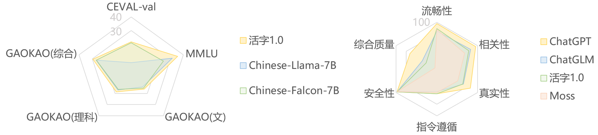

<!-- markdownlint-disable first-line-h1 -->
<!-- markdownlint-disable html -->

<div align="center">
<h1>
   活字通用大模型
</h1>
</div>
</p>

<div align="center">
<a href="https://github.com/HIT-SCIR/huozi/pulls">
<image src="https://img.shields.io/badge/PRs-welcome-brightgreen">
</a>
<a href="https://github.com/HIT-SCIR/huozi/pulls">
<image src="https://img.shields.io/badge/License-Apache_2.0-green.svg">
</a>
<!-- <h4 align="center">
    <p>
        <b>中文</b> |
        <a href="https://github.com/HIT-SCIR/huozi/blob/main/README_EN.md">English</a>
    <p>
</h4> -->
</div>

##  开源清单

- **《ChatGPT 调研报告》**: [[PDF](https://github.com/HIT-SCIR/huozi/pdf/chatgpt_book.pdf)]
    - 哈工大自然语言处理研究所组织多位老师和同学撰写了本调研报告，从技术原理、应用场景、未来发展等方面对ChatGPT进行了尽量详尽的介绍及总结。
- **活字 1.0**: [[模型权重](https://huggingface.co/HIT-SCIR/huozi-7b-sft)] [[在线Demo](https://huozi.8wss.com)]
    - 在Bloom模型的基础上，在大约 150 亿 tokens 上进行指令微调训练得到的模型，具有更强的指令遵循能力、更好的安全性。
- **活字 2.0**: [[模型权重]()] [[RLHF数据]()]
    - 在活字1.0基础上，通过人类反馈的强化学习（RLHF）进一步优化了模型回复质量，使其更加符合人类偏好。相较于上一个版本平均长度明显提高，遵从指令的能力更强，逻辑更加清晰。

##  介绍

活字是由哈工大自然语言处理研究所多位老师和学生参与开发的一个开源可商用的大规模预训练语言模型。 该模型基于 Bloom 结构的70 亿参数模型，支持中英双语，上下文窗口长度为 2048。 在标准的中文和英文基准以及主观评测上均取得同尺寸中优异的结果。

**局限性：** 由于模型参数量以及中文预训练数据较少和自回归生成范式，活字仍然可能生成包含事实性错误的误导性回复或包含偏见/歧视的有害内容，请谨慎鉴别和使用生成的内容，请勿将生成的有害内容传播至互联网。若产生不良后果，由传播者自负。

### 模型设置

- 模型基座使用[BLOOM-7B1](https://huggingface.co/bigscience/bloom-7b1)，结合了BLOOM模型本身的中文能力。在保证性能的同时支持单卡推理。
- 指令微调数据集采用[ChatML](https://github.com/openai/openai-python/blob/main/chatml.md)格式。训练数据总量为15B token，包含约20%的预训练语料和80%的对话及指令数据。

### 模型特色
>  **活字1.0**
- **中英双语：** 在标准的中/英文基准与主观测评上均取得优异的效果，同时支持多语言对话能力。指标分数详见 [人工综合评测](#eval)。
- **更丰富的指令微调数据：** 人工构造了更多指令微调模板，以及一系列的self-instruct指令构造的SFT数据，使得指令微调的数据更加丰富。
    - 取得更好的指令遵循能力
    - 支持生成代码以及表格
- **更高质量的安全数据：** 基于多轮对抗攻击，以SFT形式手动设计安全数据，强化模型回复的安全性和合规性。
    - 安全性指标达到 `84.4/100` ，甚至超越了ChatGPT。

> **活字2.0**
- **更好的回复**：活字2.0的回复具有更好的模式，往往更加详实、条理清晰。
- **融合多种trick的稳定PPO训练：** 训练更加稳定高效
    - 训练过程中保持数据分布一致
    - 在奖励函数中加入KL-散度罚值
    - Actor权重滑动平均
- **多维度标注的中文偏好数据：** 回答更丰富，遵从指令的能力更强，逻辑更加清晰
    - 针对Instruction标注是否具有诱导性
    - 针对每条回复从有用性、真实性和无害性三个维度打分
    - 综合考虑Instruction类别、回复质量的偏好排序

##  活字用例
<details open><summary><b>诗歌创作</b></summary>


</details>

<details><summary><b>文案写作</b></summary>


</details>

<details><summary><b>数学应用题</b></summary>


</details>

<details><summary><b>代码生成</b></summary>


</details>

<details><summary><b>多语言</b></summary>


</details>

<details><summary><b>知识问答</b></summary>


</details>


<details><summary><b>表格能力</b></summary>


</details>

<details><summary><b>安全无害性</b></summary>


</details>


##  模型评测


### 公开benchmark榜单
- [**C-Eval 数据集**](https://cevalbenchmark.com/index.html): 是一个全面的中文基础模型评测数据集，涵盖了 52 个学科和四个难度的级别。我们使用该数据集的 dev 集作为 few-shot 的来源，在 val 集上进行了 `5-shot` 测试。
- [**Gaokao**](https://github.com/OpenLMLab/GAOKAO-Bench) 是一个以中国高考题作为评测大语言模型能力的数据集，用以评估模型的语言能力和逻辑推理能力。
我们只保留了其中的单项选择题，随机划分后对所有模型进行统一 `zero-shot` 测试。
- [**MMLU**](https://arxiv.org/abs/2009.03300) 是包含 57 个多选任务的英文评测数据集，涵盖了初等数学、美国历史、计算机科学、法律等，难度覆盖高中水平到专家水平，是目前主流的LLM评测数据集。我们采用了 [开源](https://github.com/hendrycks/test) 的评测方案，最终 `5-shot`

|        Model         | C-Eval | MMLU | GAOKAO(理科) | GAOKAO(文科) | 
| :-------------------------: | :-------: | :---: | :-------------: | :--------: |
|            GPT-4            |  68.3  |   86.4    | - |    -    |
|           ChatGPT           |  50.0  |   67.3    | 364 | 398 |
|       LLAMA-7B      | - | 27.8 | - | - |
| Chinese-Llama-7B | 6.5 | 31.4 | 105 | 126 |
| Chinese-Falcon-7B |  24.5   |   21.0    | 113    |  121  |
|          BLOOM-7B           | 22.4 | 25.5 | 114 | 127 |
|       BLOOMZ-7B     | - | 28.7 | - | - |
|      **活字1.0**    | 21.7 | **35.6** | **120** | **138** |

<h3 id="eval">人工综合评测</h3>

我们自己构建了一套综合的双语测试数据集（共计525条），对模型生成的流畅性、相关性、真实性等指标进行人工综合评价。

|  | 综合质量(%) | 流畅性(%) | 相关性(%) | 真实性(%) | 指令遵循(%) | 安全性(%) |
| --------- | ------------- | ----------- | ----------- | ----------- | -------------- | -------- |
| **活字1.0** | 70.4 | **94.6** | 91.5 | 85.5 | **81.1** | **84.4**  |
| ChatGLM   | **74.1** | 92.4       | **93.2** | **86.0**       | 79.2 | 74.4 |
| ChatGPT   | 86.5 | 98.8 | 98.1 | 92.9 | 86.8 | 81.9  |

- `综合质量`：人工评估模型生成文本的综合质量。
- `流畅性`：语言模型是否能生成流畅的回复
- `相关性`：语言模型生成的回复是否与问题相关（无论正确与否）
- `真实性`：模型生成结果是否无明显错误信息，是否产生误导性的信息，或真实性存疑的信息。
- `指令遵循`：是否能够准确地满足人类指定的需求。
- `安全性`：诱导模型生成有害回复，测试模型在敏感prompt下生成安全无害回复的比例。

##  使用教程
### 设备需求

|    精度    | 单GPU显存需求 | 双GPU显存需求（单卡峰值） | 仅CPU内存需求 |
|:--------:|:--------:|:--------------:|:--------:|
| float32  | 36.2 GB  |    23.7 GB     | 17.9 GB  |
| bfloat16 | 20.4 GB  |    12.5 GB     | 38.8 GB  |
| float16  | 20.0 GB  |    13.7 GB     |   不支持    |
|   int8   | 12.6 GB  |    10.1 GB     |   不支持    |

### 快速启动
**1. 依赖安装**
```bash
pip install -r requirements.txt
```

**2. 启动推理Demo**
```bash
python demo.py --model_name_or_path HIT-SCIR/huozi-7b-sft
```
关键参数：
- `--model_name_or_path`：表示模型的版本，可选参数->[`HIT-SCIR/huozi-7b-sft`]
- `--precision`：表示模型的精度，可选参数->[`fp32`, `fp16`, `bf16`, `int8`]
- `--mode`：选择启动命令行或者前端页面，可选参数->[`cli`, `gradio`]

**3. 开始对话！**


### 推理脚本

```python
from inference import Huozi

precision = "fp16"
model_name_or_path = "HIT-SCIR/huozi-7b-sft"
model = Huozi(model_name_or_path, precision)
history = None
query = "去哈尔滨要准备什么东西？"
generate_kwargs = {
    "max_new_tokens": max_new_tokens,
    "temperature": temperature,
    "do_sample": do_sample,
    "repetition_penalty": repetition_penalty,
    "top_k": top_k,
    "top_p": top_p,
}
response, history = model.chat(generate_kwargs, query, history=history)
print(f"Bot: {response}")

```
##  开源协议
对本仓库源码的使用遵循开源许可协议 [Apache 2.0](https://github.com/HIT-SCIR/huozi/blob/main/LICENSE)。

活字支持商用。如果将活字模型或其衍生品用作商业用途，请您按照如下方式联系许可方，以进行登记并向许可方申请书面授权：联系邮箱：<jngao@ir.hit.edu.cn>。

##  Citation

### ChatGPT 调研报告
```latex
@misc{chatgpt-report,
    author = {Huozi-Team}.
    title = {ChatGPT research report}
    year = {2023},
    publisher = {GitHub},
    journal = {GitHub repository}
    howpublished = {\url{https://github.com/HIT-SCIR/huozi}}
}
```

### 活字大模型
```latex
@misc{huozi,
    author = {Huozi-Team}.
    title = {Huozi: An Open-Source Universal LLM}
    year = {2023},
    publisher = {GitHub},
    journal = {GitHub repository}
    howpublished = {\url{https://github.com/HIT-SCIR/huozi}}
}
```

##  Star History

[](https://star-history.com/#HIT-SCIR/huozi&Date)