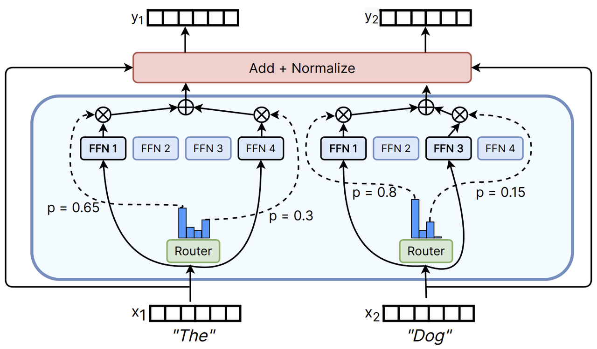
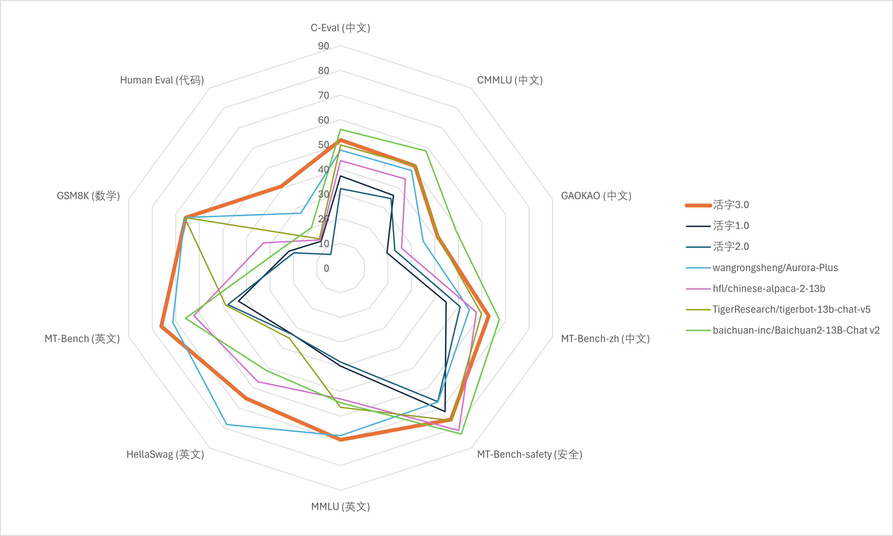
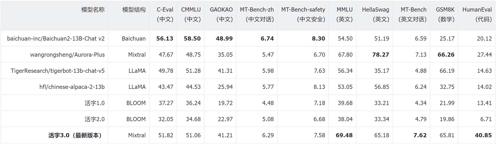
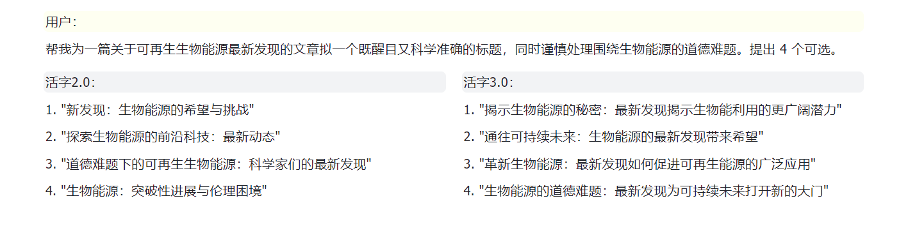
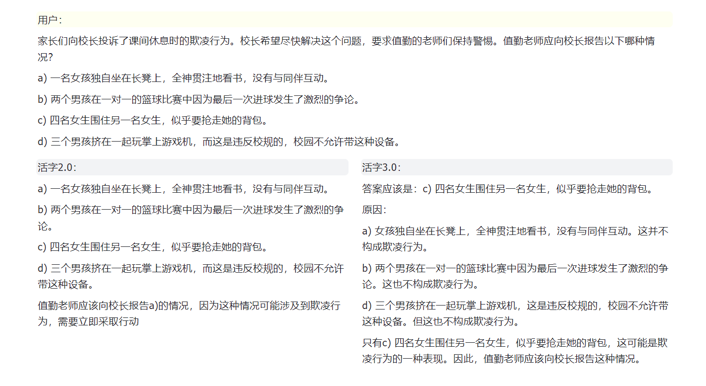
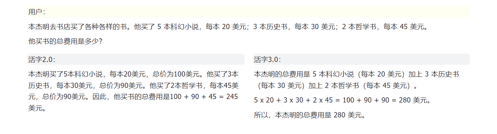
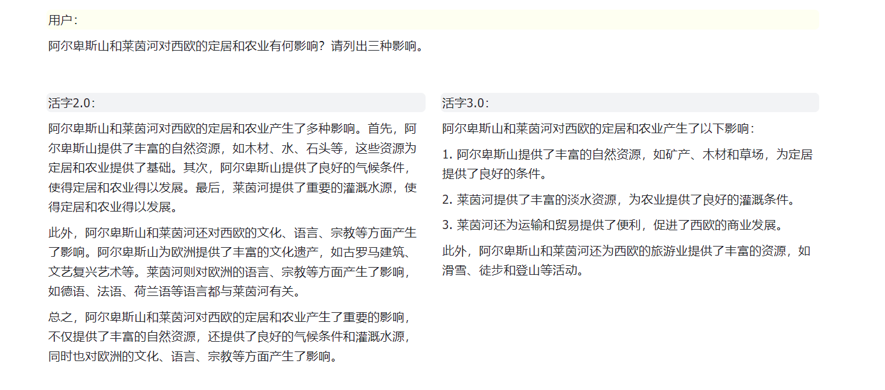
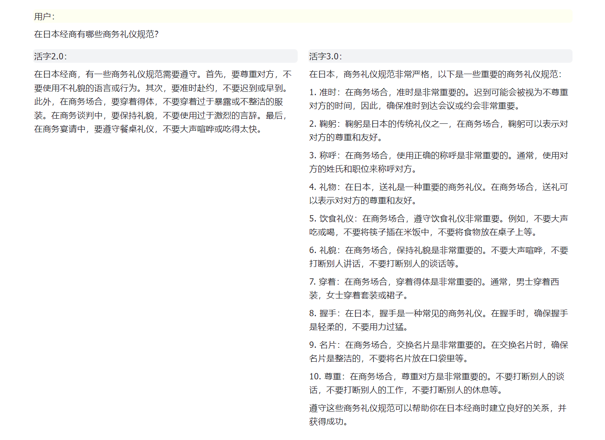

<!-- markdownlint-disable first-line-h1 -->
<!-- markdownlint-disable html -->

<div align="center">
<h1>
   活字通用大模型
</h1>
</div>
</p>

<div align="center">
<a href="https://github.com/HIT-SCIR/huozi/pulls">
<image src="https://img.shields.io/badge/PRs-welcome-brightgreen">
</a>
<a href="https://github.com/HIT-SCIR/huozi/pulls">
<image src="https://img.shields.io/badge/License-Apache_2.0-green.svg">
</a>
<!-- <h4 align="center">
    <p>
        <b>中文</b> |
        <a href="https://github.com/HIT-SCIR/huozi/blob/main/README_EN.md">English</a>
    <p>
</h4> -->
</div>

## 🎉 更新

- [2024-02-09] 发布活字3.0版本和中文MT-Bench数据集
- [2023-08-06] 发布活字1.0和活字2.0版本
- [2023-05-04] 发布《ChatGPT调研报告》；内测活字大模型

## 🔖 目录

|章节|说明|
|---|---|
|[💁🏻‍♂ 开源清单](#-开源清单)|本仓库开源项目清单|
|[💡 模型介绍](#-模型介绍)|简要介绍活字模型结构和训练过程|
|[📥 模型下载](#-模型下载)|活字模型下载链接|
|[💻 模型推理](#-模型推理)|活字模型推理样例，包括vLLM推理加速、llama.cpp量化推理等框架的使用流程|
|[📈 模型性能](#-模型性能)|活字模型在主流评测任务上的性能|
|[🗂 生成样例](#-生成样例)|活字模型实际生成效果样例|

## 💁🏻‍♂ 开源清单

- **活字 3.0**: [[模型权重](#-模型下载)]
    - 活字3.0为一个稀疏混合专家模型，支持32K上下文，具有丰富的中、英文知识和强大的数学推理、代码生成能力。活字3.0较旧版活字具有更强的指令遵循能力和安全性。
- **中文MT-Bench**: [[数据集](data/mt-bench-zh/)]
    - 本数据集是英文MT-Bench对话能力评测数据集的中文版。它包含了一系列多轮对话问题，每一组问题都经过了精心的人工校对，并为适应中文语境进行了必要的调整。
- **《ChatGPT 调研报告》**: [[PDF](https://github.com/HIT-SCIR/huozi/blob/main/pdf/chatgpt_book.pdf)]
    - 哈工大自然语言处理研究所组织多位老师和同学撰写了本调研报告，从技术原理、应用场景、未来发展等方面对ChatGPT进行了尽量详尽的介绍及总结。
- **活字 2.0**: [[模型权重](https://huggingface.co/HIT-SCIR/huozi-7b-rlhf)] [[RLHF数据](data/huozi-rlhf/huozi_rlhf_data.csv)]
    - 在活字1.0基础上，通过人类反馈的强化学习（RLHF）进一步优化了模型回复质量，使其更加符合人类偏好。相较于上一个版本平均长度明显提高，遵从指令的能力更强，逻辑更加清晰。
    - 16.9k 人工标注的偏好数据，回复来自活字模型，可以用于训练奖励模型。
- **活字 1.0**: [[模型权重](https://huggingface.co/HIT-SCIR/huozi-7b-sft)]
    - 在Bloom模型的基础上，在大约 150 亿 tokens 上进行指令微调训练得到的模型，具有更强的指令遵循能力、更好的安全性。

## 💡 模型介绍

大规模语言模型（LLM）在自然语言处理领域取得了显著的进展，并在广泛的应用场景中展现了其强大的潜力。这一技术不仅吸引了学术界的广泛关注，也成为了工业界的热点。在此背景下，哈尔滨工业大学社会计算与信息检索研究中心（HIT-SCIR）近期推出了最新成果——**活字3.0**，致力于为自然语言处理的研究和实际应用提供更多可能性和选择。

活字3.0是基于Chinese-Mixtral-8x7B，在大约30万行指令数据上微调得到的模型。该模型支持**32K上下文**，能够有效处理长文本。活字3.0继承了基座模型丰富的**中英文知识**，并在**数学推理**、**代码生成**等任务上具有强大性能。经过指令微调，活字3.0还在**指令遵循能力**和**安全性**方面实现了显著提升。

此外，我们开源了**中文MT-Bench数据集**。这是一个中文开放问题集，包括80组对话任务，用于评估模型的多轮对话和指令遵循能力。该数据集是根据原始MT-Bench翻译得来的，每组问题均经过人工校对和中文语境下的适当调整。我们还对原始MT-Bench中的部分错误答案进行了修正。

> [!IMPORTANT]
> 活字系列模型仍然可能生成包含事实性错误的误导性回复或包含偏见/歧视的有害内容，请谨慎鉴别和使用生成的内容，请勿将生成的有害内容传播至互联网。

> 活字1.0和活字2.0的文档请见[此处](README-v1v2.md)。

### 模型结构

活字3.0是一个稀疏混合专家模型（SMoE），使用了Mixtral-8x7B的模型结构。它区别于LLaMA、BLOOM等常见模型，活字3.0的每个前馈神经网络（FFN）层被替换为了“专家层”，该层包含8个FFN和一个“路由器”。这种设计使得模型在推理过程中，可以独立地将每个Token路由到最适合处理它的两个专家中。活字3.0共拥有46.7B个参数，但得益于其稀疏激活的特性，实际推理时仅需激活13B参数，有效提升了计算效率和处理速度。



### 训练过程

由于Mixtral-8x7B词表不支持中文，因此对中文的编解码效率较低，限制了中文场景下的实用性。我们首先基于Mixtral-8x7B进行了中文扩词表增量预训练，显著提高了模型对中文的编解码效率，并使模型具备了强大的中文生成和理解能力。这项成果名为[Chinese-Mixtral-8x7B](https://github.com/HIT-SCIR/Chinese-Mixtral-8x7B)，我们已于2024年1月18日开源了其模型权重和训练代码。基于此，我们进一步对模型进行指令微调，最终推出了活字3.0。这一版本的中文编码、指令遵循、安全回复等能力都有显著提升。

## 📥 模型下载

|模型名称|文件大小|下载地址|备注|
|:---:|:---:|:---:|:---:|
|huozi3|88GB|[🤗HuggingFace](https://huggingface.co/HIT-SCIR/huozi3)<br>[ModelScope](https://modelscope.cn/models/HIT-SCIR/huozi3/summary)|活字3.0 完整模型|
|huozi3-gguf|25GB|[🤗HuggingFace](https://huggingface.co/HIT-SCIR/huozi3-gguf)<br>[ModelScope](https://modelscope.cn/models/HIT-SCIR/huozi3-gguf/summary)|活字3.0 GGUF版本，适用于llama.cpp等推理框架|
|huozi3-awq|24GB|[🤗HuggingFace](https://huggingface.co/HIT-SCIR/huozi3-awq)<br>[ModelScope](https://modelscope.cn/models/HIT-SCIR/huozi3-awq/summary)|活字3.0 AWQ版本，适用于AutoAWQ等推理框架|

如果您希望微调活字3.0或Chinese-Mixtral-8x7B，请参考[此处训练代码](https://github.com/HIT-SCIR/Chinese-Mixtral-8x7B?tab=readme-ov-file#%E5%BE%AE%E8%B0%83)。

## 💻 模型推理

### Quick Start

活字3.0采用ChatML格式的prompt模板，格式为：
```
<|beginofutterance|>系统
{system prompt}<|endofutterance|>
<|beginofutterance|>用户
{input}<|endofutterance|>
<|beginofutterance|>助手
{output}<|endofutterance|>
```

使用活字3.0进行推理的示例代码如下：
```python
# quickstart.py

import torch
from transformers import AutoModelForCausalLM, AutoTokenizer

model_id = "HIT-SCIR/huozi3"

tokenizer = AutoTokenizer.from_pretrained(model_id)
model = AutoModelForCausalLM.from_pretrained(
    model_id,
    attn_implementation="flash_attention_2",
    torch_dtype=torch.bfloat16,
    device_map="auto",
)

text = """<|beginofutterance|>系统
你是一个智能助手<|endofutterance|>
<|beginofutterance|>用户
请你用python写一段快速排序的代码<|endofutterance|>
<|beginofutterance|>助手
"""

inputs = tokenizer(text, return_tensors="pt").to(0)

outputs = model.generate(
    **inputs,
    eos_token_id=57001,
    temperature=0.8,
    top_p=0.9,
    max_new_tokens=2048,
)
print(tokenizer.decode(outputs[0], skip_special_tokens=False))
```

活字3.0支持全部Mixtral模型生态，包括Transformers、vLLM、llama.cpp、AutoAWQ、Text generation web UI等框架。

如果您在下载模型时遇到网络问题，可以使用我们在[ModelScope](#modelscope-模型推理)上提供的检查点。

<details>
<summary>

#### Transformers 模型推理 + 流式生成

</summary>

transformers支持为tokenizer添加聊天模板，并支持流式生成。示例代码如下：
```python
# example/transformers-stream/stream.py

import torch
from transformers import AutoModelForCausalLM, AutoTokenizer, TextStreamer

model_id = "HIT-SCIR/huozi3"

model = AutoModelForCausalLM.from_pretrained(
    model_id,
    attn_implementation="flash_attention_2",
    torch_dtype=torch.bfloat16,
    device_map="auto",
)

tokenizer = AutoTokenizer.from_pretrained(model_id)
tokenizer.chat_template = """{{'<|beginofutterance|>' + message['role'] + '\n' + message['content']}}{{ '<|endofutterance|>' + '\n'}}
{{ '<|beginofutterance|>助手\n' }}"""

chat = [
    {"role": "系统", "content": "你是一个智能助手"},
    {"role": "用户", "content": "请你用python写一段快速排序的代码"},
]

inputs = tokenizer.apply_chat_template(
    chat,
    tokenize=True,
    add_generation_prompt=True,
    return_tensors="pt",
).to(0)

stream_output = model.generate(
    inputs,
    streamer=TextStreamer(tokenizer, skip_prompt=True, skip_special_tokens=True),
    eos_token_id=57001,
    temperature=0.8,
    top_p=0.9,
    max_new_tokens=2048,
)
```

</details>

<details>
<summary>

#### ModelScope 模型推理

</summary>

ModelScope的接口与Transformers非常相似，只需将transformers替换为modelscope即可：
```diff
# example/modelscope-generate/generate.py

import torch
- from transformers import AutoModelForCausalLM, AutoTokenizer
+ from modelscope import AutoTokenizer, AutoModelForCausalLM

model_id = "HIT-SCIR/huozi3"

tokenizer = AutoTokenizer.from_pretrained(model_id)
model = AutoModelForCausalLM.from_pretrained(
    model_id,
    attn_implementation="flash_attention_2",
    torch_dtype=torch.bfloat16,
    device_map="auto",
)

text = """<|beginofutterance|>系统
你是一个智能助手<|endofutterance|>
<|beginofutterance|>用户
请你用python写一段快速排序的代码<|endofutterance|>
<|beginofutterance|>助手
"""

inputs = tokenizer(text, return_tensors="pt").to(0)

outputs = model.generate(
    **inputs,
    eos_token_id=57001,
    temperature=0.8,
    top_p=0.9,
    max_new_tokens=2048,
)
print(tokenizer.decode(outputs[0], skip_special_tokens=False))
```

</details>

<details>
<summary>

#### vLLM 推理加速

</summary>

活字3.0支持通过vLLM实现推理加速，示例代码如下：
```python
# example/vllm-generate/generate.py

from vllm import LLM, SamplingParams

prompts = [
    """<|beginofutterance|>系统
你是一个智能助手<|endofutterance|>
<|beginofutterance|>用户
请你用python写一段快速排序的代码<|endofutterance|>
<|beginofutterance|>助手
""",
]

sampling_params = SamplingParams(
    temperature=0.8, top_p=0.95, stop_token_ids=[57001], max_tokens=2048
)
llm = LLM(
    model="HIT-SCIR/huozi3",
    tensor_parallel_size=4,
)
outputs = llm.generate(prompts, sampling_params)

for output in outputs:
    prompt = output.prompt
    generated_text = output.outputs[0].text
    print(generated_text)
```

</details>

<details>
<summary>

#### 部署 OpenAI API Server

</summary>

活字3.0可以部署为支持OpenAI API协议的服务，这使得活字3.0可以直接通过OpenAI API进行调用。

环境准备：
```shell
$ pip install vllm openai
```

启动服务：
```shell
$ python -m vllm.entrypoints.openai.api_server --model /path/to/huozi3/checkpoint --served-model-name huozi --chat-template template.jinja --tensor-parallel-size 8 --response-role 助手 --max-model-len 2048
```

使用OpenAI API发送请求：
```python
# example/openai-api/openai-client.py

from openai import OpenAI

openai_api_key = "EMPTY"
openai_api_base = "http://localhost:8000/v1"

client = OpenAI(
    api_key=openai_api_key,
    base_url=openai_api_base,
)

chat_response = client.chat.completions.create(
    model="huozi",
    messages=[
        {"role": "系统", "content": "你是一个智能助手"},
        {"role": "用户", "content": "请你用python写一段快速排序的代码"},
    ],
    extra_body={"stop_token_ids": [57001]},
)
print("Chat response:", chat_response.choices[0].message.content)
```

下面是一个使用OpenAI API + Gradio + 流式生成的示例代码：
```python
# example/openai-api/openai-client-gradio.py

from openai import OpenAI
import gradio as gr

openai_api_key = "EMPTY"
openai_api_base = "http://localhost:8000/v1"

client = OpenAI(
    api_key=openai_api_key,
    base_url=openai_api_base,
)


def predict(message, history):
    history_openai_format = [
        {"role": "系统", "content": "你是一个智能助手"},
    ]
    for human, assistant in history:
        history_openai_format.append({"role": "用户", "content": human})
        history_openai_format.append({"role": "助手", "content": assistant})
    history_openai_format.append({"role": "用户", "content": message})
    models = client.models.list()

    stream = client.chat.completions.create(
        model=models.data[0].id,
        messages=history_openai_format,
        temperature=0.8,
        stream=True,
        extra_body={"repetition_penalty": 1, "stop_token_ids": [57001]},
    )

    partial_message = ""
    for chunk in stream:
        partial_message += chunk.choices[0].delta.content or ""
        yield partial_message


gr.ChatInterface(predict).queue().launch()
```

</details>

### 量化推理

活字3.0支持量化推理，下表为活字3.0在各个量化框架下显存占用量：

|量化方法|显存占用|
|:---:|:---:|
|无|95GB|
|AWQ|32GB|
|GGUF(q4_0)|28GB|
|GGUF(q2_k)|18GB|
|GGUF(q2_k, offload 16层)|9.6GB|

<details>
<summary>

#### GGUF 格式

</summary>

GGUF格式旨在快速加载和保存模型，由llama.cpp团队推出。我们已经提供了[GGUF格式的活字3.0](https://huggingface.co/HIT-SCIR/huozi3-gguf)。

您也可以手动将HuggingFace格式的活字3.0转换到GGUF格式，以使用其他的量化方法。

##### Step 1 环境准备

首先需要下载llama.cpp的源码。我们在仓库中提供了llama.cpp的submodule，这个版本的llama.cpp已经过测试，可以成功进行推理：
```shell
$ git clone --recurse-submodules https://github.com/HIT-SCIR/huozi
$ cd examples/llama.cpp
```

您也可以下载最新版本的llama.cpp源码：
```shell
$ git clone https://github.com/ggerganov/llama.cpp.git
$ cd llama.cpp
```

然后需要进行编译。根据您的硬件平台，编译命令有细微差异：
```shell
$ make  # 用于纯CPU推理
$ make LLAMA_CUBLAS=1  # 用于GPU推理
$ LLAMA_METAL=1 make  # 用于Apple Silicon，暂未经过测试
```

##### Step 2 格式转换（可选）

以下命令需要在`llama.cpp/`目录下：
```shell
# 转换为GGUF格式
$ python convert.py --outfile /path/to/huozi-gguf/huozi3.gguf /path/to/huozi3
# 进行GGUF格式的q4_0量化
$ quantize /path/to/huozi-gguf/huozi3.gguf /path/to/huozi-gguf/huozi3-q4_0.gguf q4_0
```

##### Step 3 开始推理

以下命令需要在`llama.cpp/`目录下：
```shell
$ main -m /path/to/huozi-gguf/huozi3-q4_0.gguf --color --interactive-first -c 2048 -t 6 --temp 0.2 --repeat_penalty 1.1 -ngl 999 --in-prefix "<|beginofutterance|>用户\n" --in-suffix "<|endofutterance|>\n<|beginofutterance|>助手" -r "<|endofutterance|>"
```

`-ngl`参数表示向GPU中offload的层数，降低这个值可以缓解GPU显存压力。经过我们的实际测试，q2_k量化的模型offload 16层，显存占用可降低至9.6GB，可在消费级GPU上运行模型：
```shell
$ main -m /path/to/huozi-gguf/huozi3-q2_k.gguf --color --interactive-first -c 2048 -t 6 --temp 0.2 --repeat_penalty 1.1 -ngl 16 --in-prefix "<|beginofutterance|>用户\n" --in-suffix "<|endofutterance|>\n<|beginofutterance|>助手" -r "<|endofutterance|>"
```

关于`main`的更多参数，可以参考llama.cpp的[官方文档](https://github.com/ggerganov/llama.cpp/tree/master/examples/main)。

</details>

<details>
<summary>

#### AWQ 格式

</summary>

AWQ是一种量化模型的存储格式。我们已经提供了[AWQ格式的活字3.0](https://huggingface.co/HIT-SCIR/huozi3-awq)，您也可以手动将HuggingFace格式的活字3.0转换到AWQ格式。

##### Step 1 格式转换（可选）

```python
# example/autoawq-generate/quant.py

from awq import AutoAWQForCausalLM
from transformers import AutoTokenizer

model_path = "/path/to/huozi3"
quant_path = "/path/to/save/huozi3-awq"
modules_to_not_convert = ["gate"]
quant_config = {
    "zero_point": True,
    "q_group_size": 128,
    "w_bit": 4,
    "version": "GEMM",
    "modules_to_not_convert": modules_to_not_convert,
}

model = AutoAWQForCausalLM.from_pretrained(
    model_path,
    safetensors=True,
    **{"low_cpu_mem_usage": True},
)
tokenizer = AutoTokenizer.from_pretrained(model_path, trust_remote_code=True)

model.quantize(
    tokenizer,
    quant_config=quant_config,
    modules_to_not_convert=modules_to_not_convert,
)

model.save_quantized(quant_path)
tokenizer.save_pretrained(quant_path)

print(f'Model is quantized and saved at "{quant_path}"')
```

##### Step 2 开始推理

在获取到AWQ格式的模型权重后，可以使用AutoAWQForCausalLM代替AutoModelForCausalLM加载模型。示例代码如下：
```diff
# example/autoawq-generate/generate.py

import torch
+ from awq import AutoAWQForCausalLM
from transformers import AutoTokenizer, TextStreamer


- model_id = "HIT-SCIR/huozi3"
+ model_id = "HIT-SCIR/huozi3-awq"  # or model_id = "/path/to/saved/huozi3-awq"

+ model = AutoAWQForCausalLM.from_quantized(model_id, fuse_layers=True)
- model = AutoModelForCausalLM.from_pretrained(
-     model_id,
-     attn_implementation="flash_attention_2",
-     torch_dtype=torch.bfloat16,
-     device_map="auto",
- )

tokenizer = AutoTokenizer.from_pretrained(model_id)
tokenizer.chat_template = """{{'<|beginofutterance|>' + message['role'] + '\n' + message['content']}}{{ '<|endofutterance|>' + '\n'}}
{{ '<|beginofutterance|>助手\n' }}"""

chat = [
    {"role": "系统", "content": "你是一个智能助手"},
    {"role": "用户", "content": "请你用python写一段快速排序的代码"},
]

inputs = tokenizer.apply_chat_template(
    chat,
    tokenize=True,
    add_generation_prompt=True,
    return_tensors="pt",
).to(0)

stream_output = model.generate(
    inputs,
    streamer=TextStreamer(tokenizer, skip_prompt=True, skip_special_tokens=True),
    eos_token_id=57001,
    temperature=0.8,
    top_p=0.9,
    max_new_tokens=2048,
)
```

</details>

## 📈 模型性能



针对大模型综合能力评价，我们分别使用以下评测数据集对活字3.0进行评测：
- C-Eval：一个全面的中文基础模型评估套件。它包含了13948个多项选择题，涵盖了52个不同的学科和四个难度级别。
- CMMLU：一个综合性的中文评估基准，专门用于评估语言模型在中文语境下的知识和推理能力，涵盖了从基础学科到高级专业水平的67个主题。
- GAOKAO：一个以中国高考题目为数据集，旨在提供和人类对齐的，直观，高效地测评大模型语言理解能力、逻辑推理能力的测评框架。
- MMLU：一个包含57个多选任务的英文评测数据集，涵盖了初等数学、美国历史、计算机科学、法律等，难度覆盖高中水平到专家水平，是目前主流的LLM评测数据集之一。
- HellaSwag：一个极具挑战的英文NLI评测数据集，每一个问题都需要对上下文进行深入理解，而不能基于常识进行回答。
- GSM8K：一个高质量的小学数学应用题的数据集，这些问题需要 2 到 8 个步骤来解决，解决方案主要涉及使用基本算术运算，可用于评价多步数学推理能力。
- HumanEval：一个由 164 个原创编程问题组成的数据集，通过衡量从文档字符串生成程序的功能正确性，来够评估语言理解、算法和简单的数学能力。
- MT-Bench：一个开放的英文问题集，包括80个多轮对话任务，用于评估聊天机器人的多轮对话和指令遵循能力，并通过大模型裁判（GPT-4）对模型回答进行打分。
- MT-Bench-zh：我们根据MT-Bench翻译得来的中文问题集，每组问题均经过人工校对和中文语境下的适当调整。我们已在[此处](data/mt-bench-zh/)开源MT-Bench-zh数据集。
- MT-Bench-safety：我们手工构造的安全数据集，包括暴力、色情、敏感等风险内容。该数据集为封闭数据集。

活字3.0在推理时仅激活13B参数。下表为活字3.0与其他13B规模的中文模型以及旧版活字在各个评测数据集上的结果：

<!-- | 模型名称                                      | 模型结构 | C-Eval<br>(中文) | CMMLU<br>(中文) | GAOKAO<br>(中文) | MT-Bench-zh<br>(中文对话) | MT-Bench-safety<br>(中文安全) | MMLU<br>(英文) | HellaSwag<br>(英文) | MT-Bench<br>(英文对话) | GSM8K<br>(数学) | HumanEval<br>(代码) |
|---------------------------------------------|---------|--------------|-------------|---------------|--------------------------|-----------------------------|------------|------------------|-----------------------|-------------|-----------------|
| baichuan-inc/Baichuan2-13B-Chat v2         | Baichuan| 56.13        | 58.50       | 48.99         | 6.74                     | 8.30                        | 54.50      | 51.19            | 6.59                  | 25.17       | 20.12           |
| wangrongsheng/Aurora-Plus                   | Mixtral | 47.67        | 48.75       | 35.05         | 5.47                     | 6.70                        | 67.80      | 78.27            | 7.13                  | 66.26       | 27.44           |
| TigerResearch/tigerbot-13b-chat-v5         | LLaMA   | 49.78        | 51.28       | 41.31         | 5.98                     | 7.63                        | 56.34      | 35.17            | 4.88                  | 66.19       | 14.63           |
| hfl/chinese-alpaca-2-13b                   | LLaMA   | 43.47        | 44.53       | 25.94         | 5.77                     | 8.13                        | 53.05      | 56.85            | 6.24                  | 32.75       | 14.02           |
| 活字1.0                                      | BLOOM   | 37.27        | 36.24       | 19.72         | 4.48                     | 7.18                        | 39.68      | 33.21            | 4.34                  | 21.99       | 13.41           |
| 活字2.0                                      | BLOOM   | 32.05        | 34.68       | 22.97         | 5.08                     | 6.68                        | 38.04      | 33.34            | 4.79                  | 19.86       | 6.71            |
| **活字3.0（最新版本）**                          | Mixtral | 51.82        | 51.06       | 41.21         | 6.29                     | 7.58                        | 69.48      | 65.18            | 7.62                  | 65.81       | 40.85           | -->


> 我们在C-Eval、CMMLU、MMLU采用5-shot，GSM8K采用4-shot，HellaSwag、HumanEval采用0-shot，HumanEval采用pass@1指标。所有测试均采用greedy策略。
>
> 我们使用OpenCompass作为评测框架，commit hash为[4c87e77](https://github.com/open-compass/opencompass/tree/4c87e777d855636b9eda7ec87bcbbf12b62caed3)。评测代码位于[此处](./evaluate/)。

根据上表中的测试结果，活字3.0较旧版活字取得了巨大的性能提升。在中文知识方面，活字3.0达到了与Tigerbot-13B-chat-v5相当的性能，并是在中文对话和指令遵循方面表现得更加优秀。在英文知识方面，得益于原版Mixtral-8x7B的强大性能，活字3.0超过了Baichuan2-13B-Chat v2和LLaMA系列的扩词表模型，并在英文对话和指令遵循能力上达到了较高水平。在数学推理和代码生成任务上，活字3.0均展现出强大的性能，这说明活字3.0对复杂问题的深层次理解、多步推理、以及结构化信息处理等方面具有较强水平。由于我们采用了较高质量的代码数据集，活字3.0的代码生成能力也超越了同为Mixtral结构的Aurora-Plus模型。

## 🗂 生成样例

下面是活字3.0在MT-Bench-zh评测集上的生成效果展示，并与活字2.0（RLHF版本）进行对比：







##  开源协议
对本仓库源码的使用遵循开源许可协议 [Apache 2.0](https://github.com/HIT-SCIR/huozi/blob/main/LICENSE)。

活字支持商用。如果将活字模型或其衍生品用作商业用途，请您按照如下方式联系许可方，以进行登记并向许可方申请书面授权：联系邮箱：<jngao@ir.hit.edu.cn>。

##  Citation

### 活字大模型

```latex
@misc{huozi,
    author = {Huozi-Team}.
    title = {Huozi: Leveraging Large Language Models for Enhanced Open-Domain Chatting}
    year = {2024},
    publisher = {GitHub},
    journal = {GitHub repository}
    howpublished = {\url{https://github.com/HIT-SCIR/huozi}}
}
```

##  Star History

[](https://star-history.com/#HIT-SCIR/huozi&Date)
